# Notion API Setup

- Navigate to the Developer page (https://developers.notion.com)
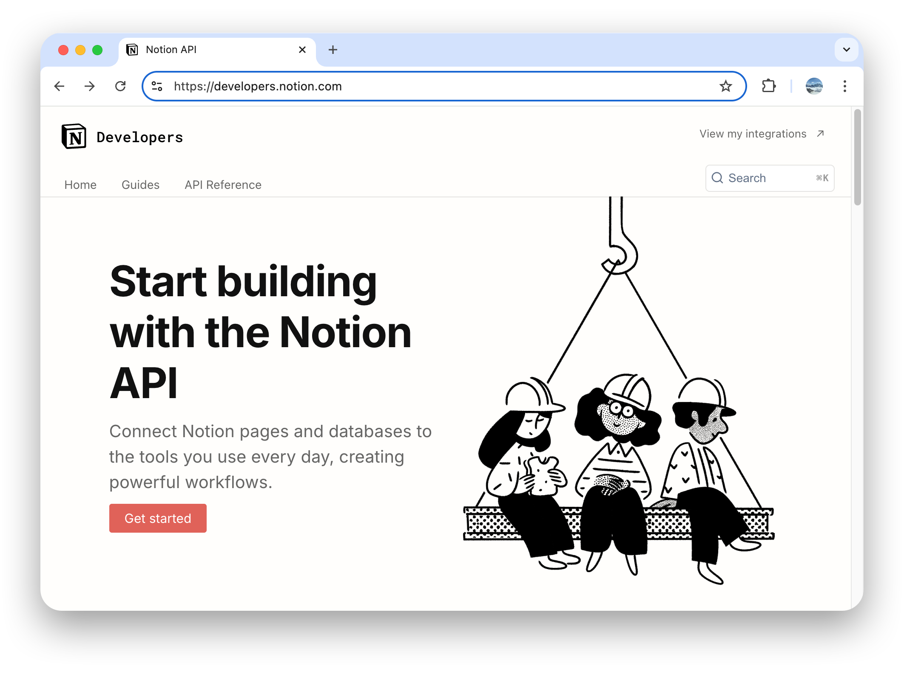

- Click "View my integrations" in the top right corner > Login
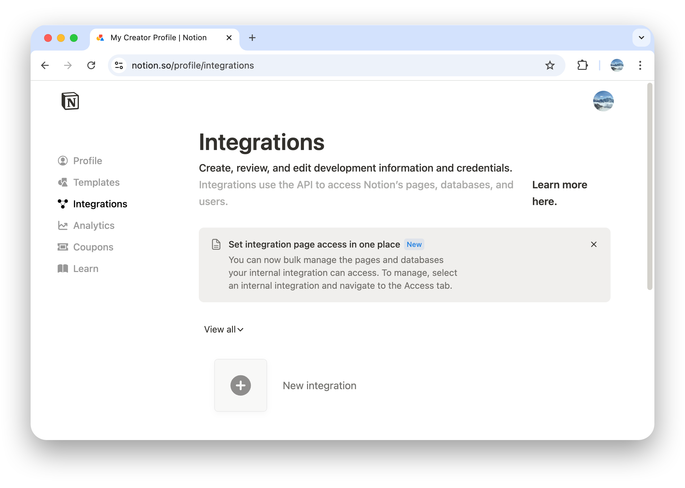

- Click "New integration"
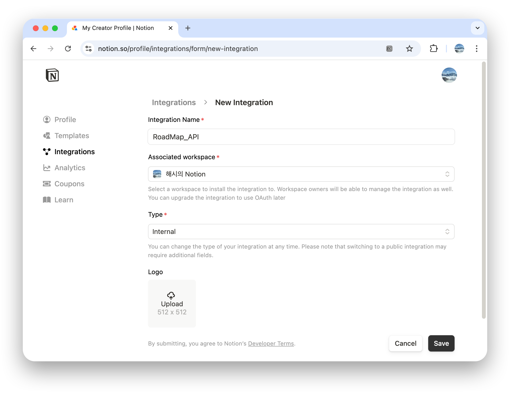
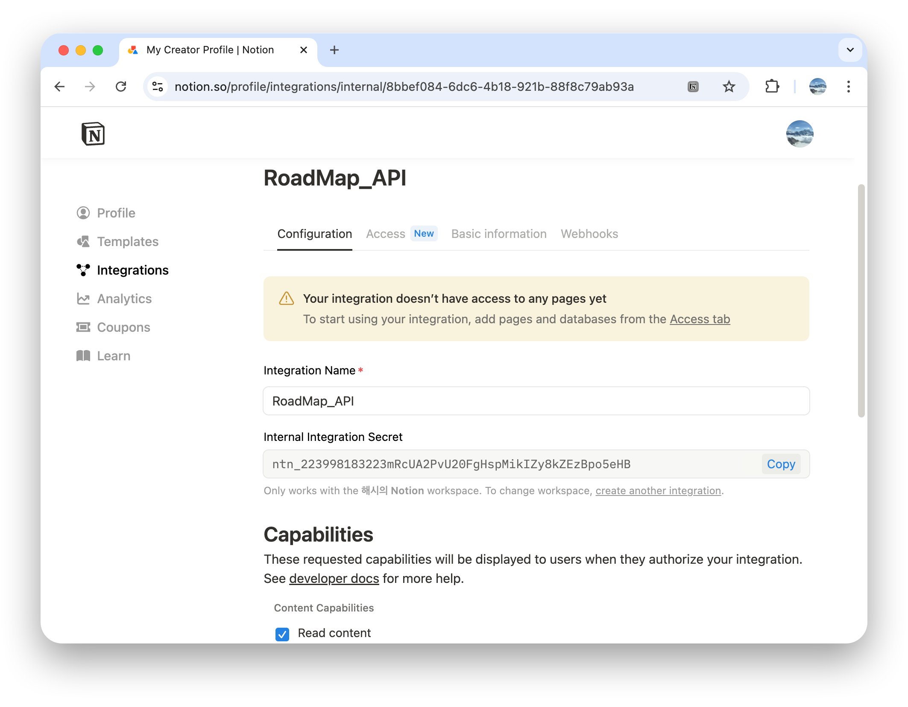

- Click "Show" to copy the API key, then enter it in RoadMap app > Settings > Notion Integration > API Key > Basic Notion Integration
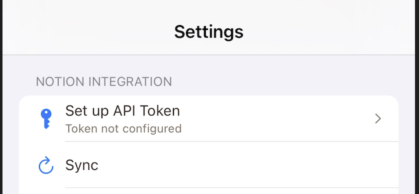

- Enter API Key
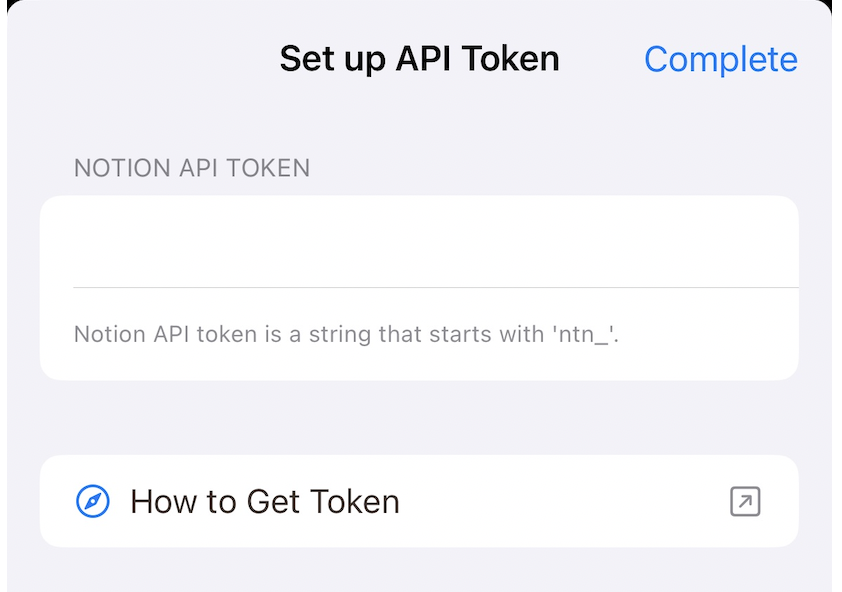

- Create New Page
	- Access template page (https://maddening-philosophy-227.notion.site/Project-RoadMap-Database-24d537221a5280f7935de0ab73cc68f0)
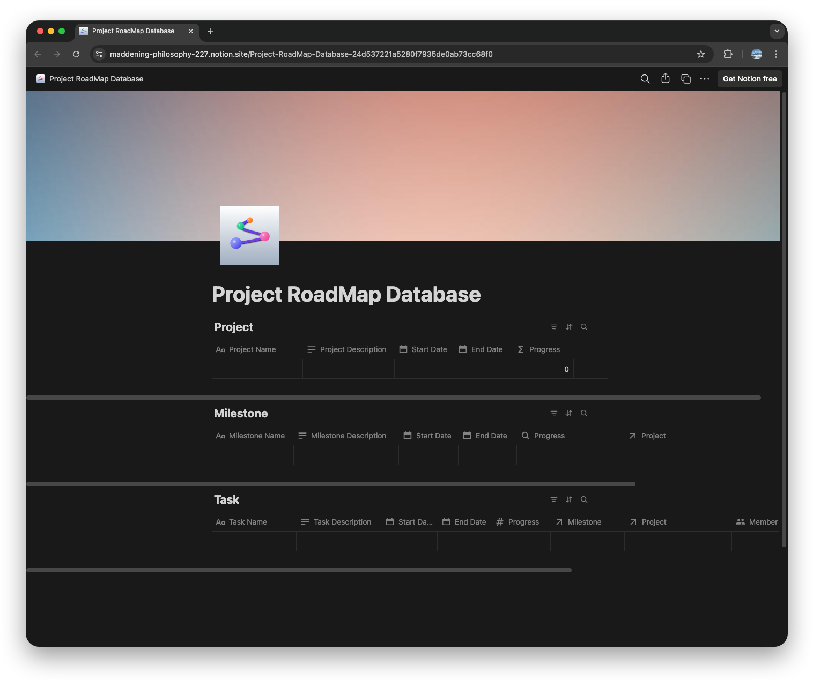

- Click "Duplicate" in the top right corner > Duplicate to your workspace
- Create a new project as shown below
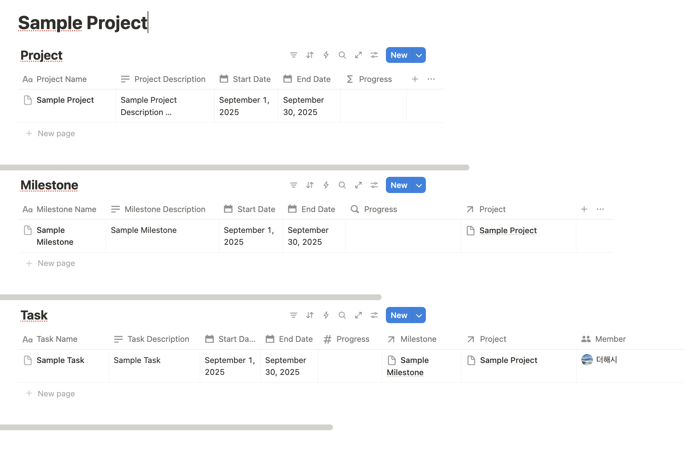

- Set Page Permissions
- Navigate to API page > Access > + Select pages
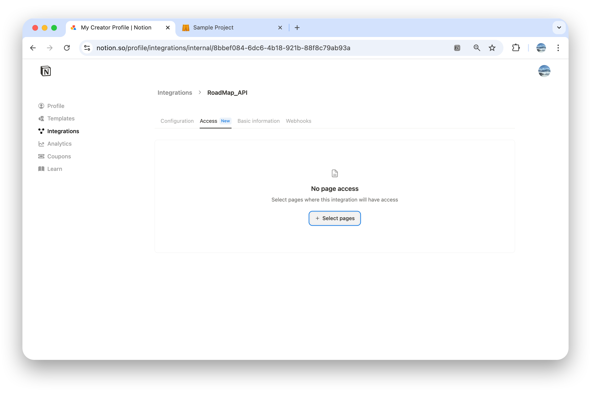

- Check the created project and click "Update access"
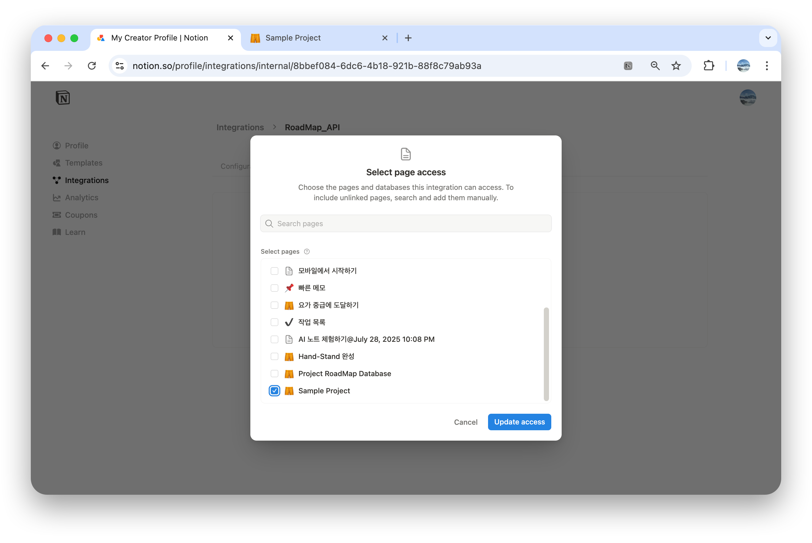

- Permission setup complete
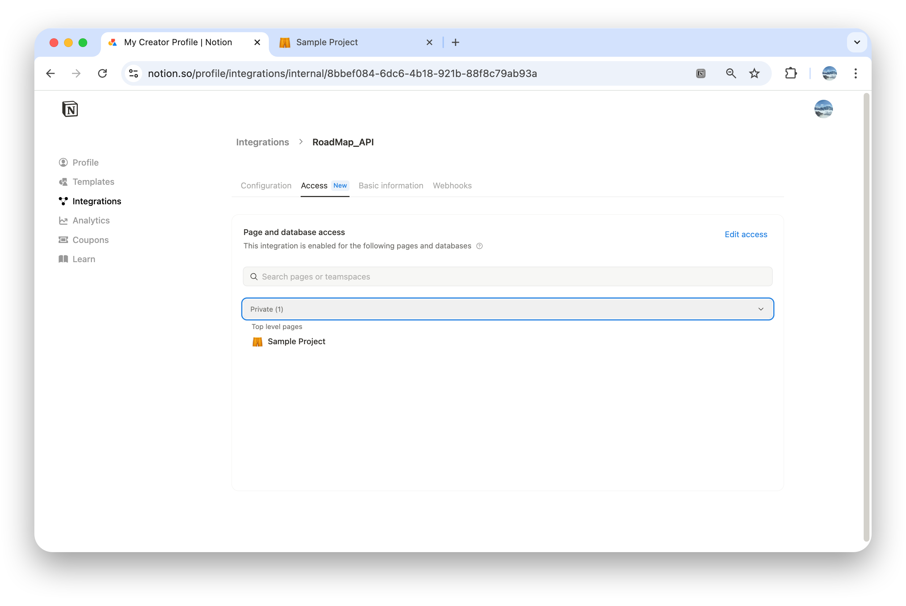

- Connect Notion in App
	- + Add tab (bottom tab bar)
	- Tap Project + to add project
	- Import from Notion

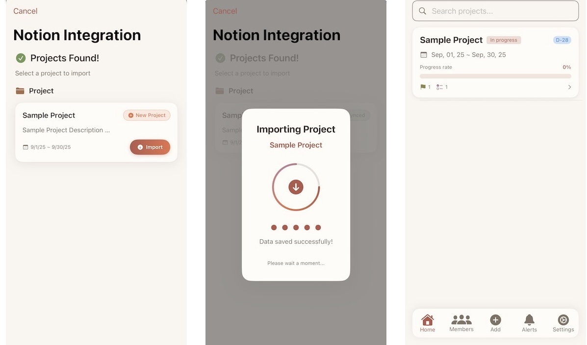