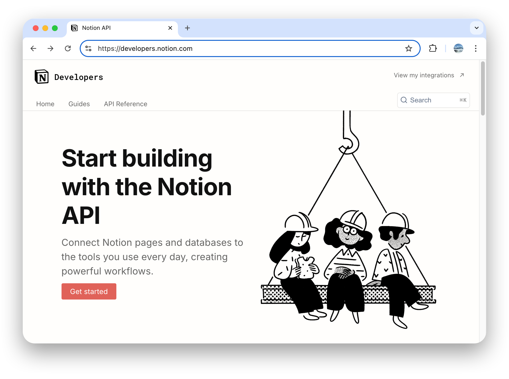
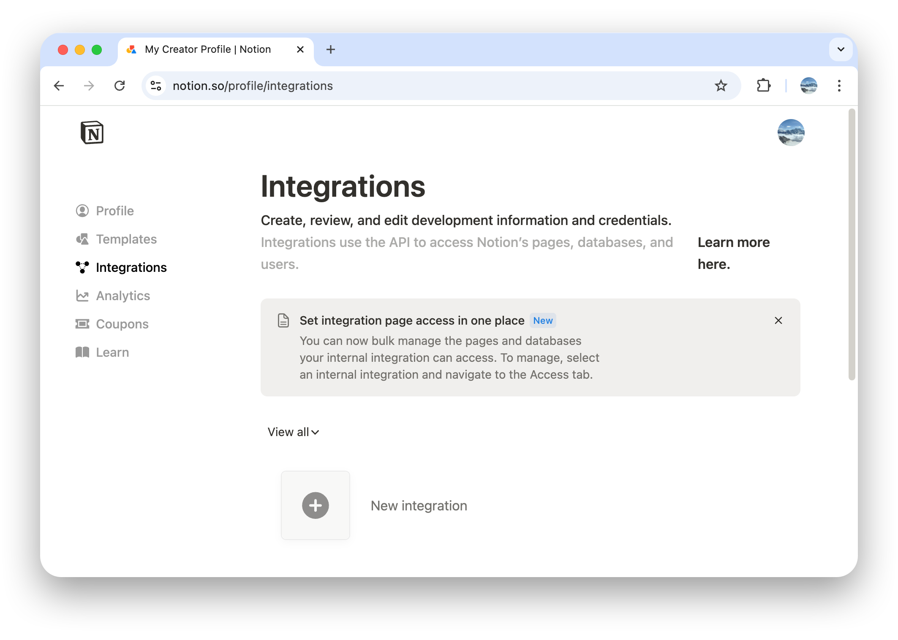
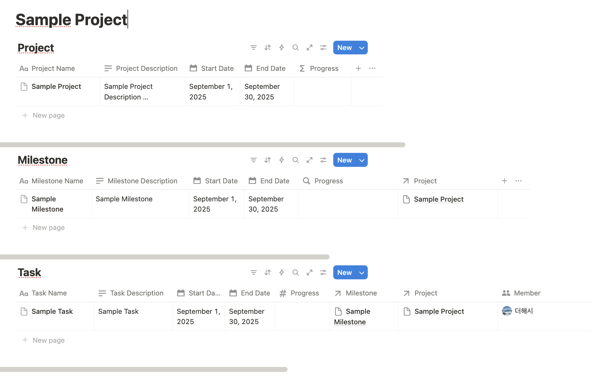

# Notion API 설정

## 1. Notion 개발자 페이지 접속
- 개발자 페이지로 이동합니다 (https://developers.notion.com)

## 2. 통합 관리 페이지 이동
- 우측 상단의 "View my integrations" 클릭 > 로그인

## 3. 새 통합 생성
- "New integration" 클릭

## 4. API 키 복사 및 앱 설정
- "Show"를 클릭하여 API 키를 복사한 후, RoadMap 앱 > 설정 > Notion Integration > API Key > Basic Notion Integration에 입력

- API Key 입력

## 5. 새 페이지 생성
- 새 페이지 생성
- 템플릿 페이지에 접속합니다 (https://maddening-philosophy-227.notion.site/Project-RoadMap-Database-24d537221a5280f7935de0ab73cc68f0)

- 우측 상단의 "Duplicate" 클릭 > 본인 워크스페이스에 복제
- 아래와 같이 새 프로젝트를 생성합니다

## 6. 페이지 권한 설정
- 페이지 권한 설정
- API 페이지로 이동 > Access > + Select pages

- 생성한 프로젝트를 체크하고 "Update access" 클릭

- 권한 설정 완료

## 7. 앱에서 Notion 연결
- 앱에서 Notion 연결
  - + Add tab (하단 탭 바)
  - Project + 탭하여 프로젝트 추가
  - Import from Notion

